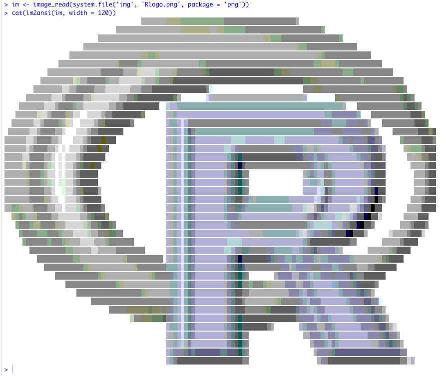
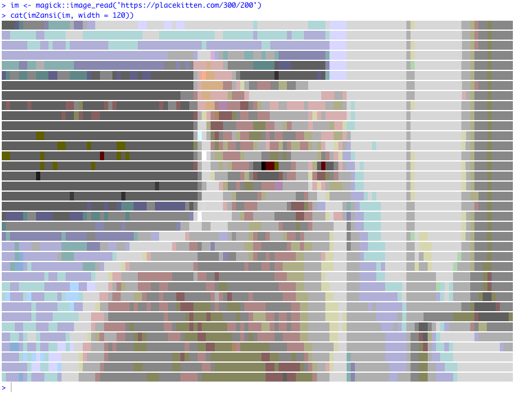
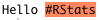
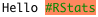

<!-- README.md is generated from README.Rmd. Please edit that file -->

```{r, include = FALSE}
knitr::opts_chunk$set(
  collapse = TRUE,
  comment = "#>",
  fig.path = "man/figures/README-",
  out.width = "100%"
)

library(ransid)
library(magick)
```

# ransid

<!-- badges: start -->

<!-- badges: end -->

`ransid` converts images to 256-colour ANSI text which can be displayed in the console.

Note to be confused with:

* [crayon](https://cran.r-project.org/package=crayon) the great, useful and well-designed
  ANSI package by Gábor Csárdi and Brodie Gaslam
* [ransid - Rust ANSI Driver](https://gitlab.redox-os.org/redox-os/ransid)

## Installation

You can install `ransid` from [github](https://github.com/coolbutuseless/ransid) with:

``` r
# install.packages('remotes')
remotes::install_github("coolbutuseless/ransid")
```

## Example

**Note** - because ANSI is for display in a terminal, it does not render in a
markdown document. The following images are screenshots of my Rstudio terminal


```{r eval=FALSE}
im <- image_read(system.file('img', 'Rlogo.png', package = 'png'))
cat(im2ansi(im, width = 120))
```

```{r echo=FALSE}

```


```{r eval=FALSE}
im <- magick::image_read('https://www.fillmurray.com/300/250')
cat(im2ansi(im, width = 120))
```

```{r echo=FALSE}
knitr::include_graphics("man/figures/murray.png")
```


```{r eval=FALSE}
im <- magick::image_read('https://placekitten.com/300/200')
cat(im2ansi(im, width = 120))
```

```{r echo=FALSE}

```


## Access raw ANSI

Lower level functions are also available.

* `col2bg` - create an ANSI sequence for a particular background colour
* `col2fg` - create an ANSI sequence for a particular foreground colour
* `im2char` - the matrix corresponding to the image, where each element represents
  one pixel


```{r}
col2bg('tomato')
paste0("Hello ", col2bg("tomato"), "#RStats", reset_code)
cat(paste0("Hello ", col2bg("tomato"), "#RStats", reset_code))
```

```{r echo=FALSE, out.width = "20%"}

```

```{r}
col2fg('darkgreen')
paste0("Hello ", col2bg('tomato'), col2fg('darkgreen'), "#RStats", reset_code)
cat(paste0("Hello ", col2bg('tomato'), col2fg('darkgreen'), "#RStats", reset_code))
```

```{r echo=FALSE, out.width="20%"}

```


```{r}
im <- image_read(system.file('img', 'Rlogo.png', package = 'png'))
char_matrix <- im2char(im)
char_matrix[1, 1:10]
```


