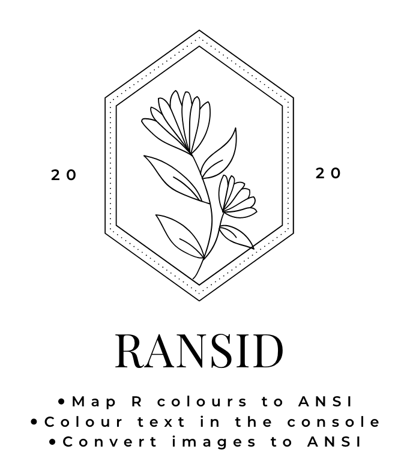
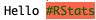

<!-- README.md is generated from README.Rmd. Please edit that file -->

# ransid 

<!-- badges: start -->

 [](https://www.tidyverse.org/lifecycle/#experimental)
<!-- badges: end -->

`ransid` converts images to ANSI text which can be displayed in the
console.

  - Supports 8-bit and 24-bit ANSI (but Rstudio terminal only supports
    8-bit colour)
  - Specify colours using standard R colour names e.g. ‘hotpink’,
    ‘skyblue’ and `ransid` will map them to the nearest available ANSI
    colour

## Installation

You can install `ransid` from
[github](https://github.com/coolbutuseless/ransid) with:

``` r
# install.packages('remotes')
remotes::install_github("coolbutuseless/ransid")
```

## Example - 216 colour ANSI

**Note** - because ANSI is for display in a terminal, it does not render
in a markdown document. The following images are screenshots of my
Rstudio terminal

``` r
im <- magick::image_read(system.file('img', 'Rlogo.png', package = 'png'))
cat(im2ansi(im, width = 120))
```


``` r
im <- magick::image_read('https://www.fillmurray.com/300/250')
cat(im2ansi(im, width = 120))
```


``` r
im <- magick::image_read('https://placekitten.com/300/200')
cat(im2ansi(im, width = 120))
```


## Example - 24bit ANSI colour

24bit colour ANSI is enabled by setting `full_colour = TRUE`

24bit ANSI colour has more limited support (compared to 8bit ANSI), and
will **not** display in Rstudio.

It will however work in `iTerm` on OSX, KDE Konsole, Xterm, libvte-based
terminals such as GNOME Terminal. See [the wikipedia
page](https://en.wikipedia.org/wiki/ANSI_escape_code) for more
information

``` r
im <- magick::image_read('https://placekitten.com/300/200')
cat(im2ansi(im, width = 200, full_colour = TRUE))
```


## Access raw ANSI

Lower level functions are also available.

  - `col2bg`, `col2bg24` - create an ANSI sequence for a particular
    background colour (8bit and 24bit versions)
  - `col2fg`, `col2fg24` - create an ANSI sequence for a particular
    foreground colour (8bit and 24bit versions)
  - `im2char` - the matrix corresponding to the image, where each
    element represents one pixel

#### `col2bg`

``` r
col2bg('tomato')
#> [1] "\033[48;5;209m"
paste0("Hello ", col2bg("tomato"), "#RStats", reset_code)
#> [1] "Hello \033[48;5;209m#RStats\033[39m\033[49m"
```

``` r
cat(paste0("Hello ", col2bg("tomato"), "#RStats", reset_code), "\n")
```


#### `col2fg`

``` r
col2fg('darkgreen')
#> [1] "\033[38;5;28m"
paste0("Hello ", col2bg('tomato'), col2fg('darkgreen'), "#RStats", reset_code)
#> [1] "Hello \033[48;5;209m\033[38;5;28m#RStats\033[39m\033[49m"
```

``` r
cat(paste0("Hello ", col2bg('tomato'), col2fg('darkgreen'), "#RStats", reset_code), "\n")
```


#### `im2char`

``` r
im <- image_read(system.file('img', 'Rlogo.png', package = 'png'))
char_matrix <- im2char(im)
char_matrix[1, 1:10]
#>  [1] "\033[48;5;231m " "\033[48;5;231m " "\033[48;5;231m " "\033[48;5;231m "
#>  [5] "\033[48;5;231m " "\033[48;5;231m " "\033[48;5;231m " "\033[48;5;231m "
#>  [9] "\033[48;5;231m " "\033[48;5;231m "
```

#### `col2bg24`

``` r
col2bg24('tomato')
#> [1] "\033[48;2;255;99;71m"
paste0("Hello ", col2bg24("tomato"), "#RStats", reset_code)
#> [1] "Hello \033[48;2;255;99;71m#RStats\033[39m\033[49m"
```

``` r
cat(paste0("Hello ", col2bg24('tomato'), col2fg24('darkgreen'), "#RStats", reset_code), "\n")
```



# Related Software

Some great R packages for ANSI handling that eclipse what this humble
package does:

  - [crayon](https://cran.r-project.org/package=crayon) the great,
    useful and well-designed ANSI package by Gábor Csárdi and Brodie
    Gaslam
  - [fansi](https://cran.r-project.org/web/packages/fansi/index.html)
    Brodie Gaslam’s comprehensive set of utilities for wrangling strings
    containing ANSI escape sequences.
