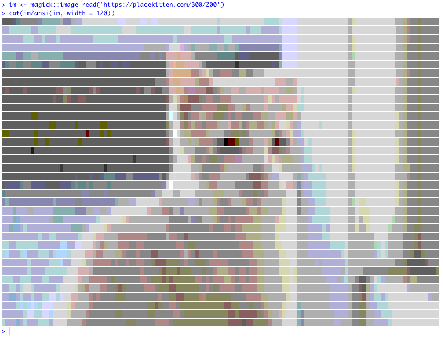

<!-- README.md is generated from README.Rmd. Please edit that file -->

# ransid

<!-- badges: start -->


<!-- badges: end -->

`ransid` converts images to 256-colour ANSI text which can be displayed
in the console.

Note to be confused with:

  - [crayon](https://cran.r-project.org/package=crayon) the great,
    useful and well-designed ANSI package by Gábor Csárdi and Brodie
    Gaslam
  - [ransid - Rust ANSI
    Driver](https://gitlab.redox-os.org/redox-os/ransid)

## Installation

You can install `ransid` from
[github](https://github.com/coolbutuseless/ransid) with:

``` r
# install.packages('remotes')
remotes::install_github("coolbutuseless/ransid")
```

## Example

**Note** - because ANSI is for display in a terminal, it does not render
in a markdown document. The following images are screenshots of my
Rstudio terminal

``` r
im <- image_read(system.file('img', 'Rlogo.png', package = 'png'))
cat(im2ansi(im, width = 120))
```


``` r
im <- magick::image_read('https://www.fillmurray.com/300/250')
cat(im2ansi(im, width = 120))
```


``` r
im <- magick::image_read('https://placekitten.com/300/200')
cat(im2ansi(im, width = 120))
```



## Access raw ANSI

Lower level functions are also available.

  - `col2bg` - create an ANSI sequence for a particular background
    colour
  - `col2fg` - create an ANSI sequence for a particular foreground
    colour
  - `im2char` - the matrix corresponding to the image, where each
    element represents one pixel

<!-- end list -->

``` r
col2bg('tomato')
#> [1] "\033[48;5;209m"
paste0("Hello ", col2bg("tomato"), "#RStats", reset_code)
#> [1] "Hello \033[48;5;209m#RStats\033[39m\033[49m"
cat(paste0("Hello ", col2bg("tomato"), "#RStats", reset_code))
#> Hello #RStats
```


``` r
col2fg('darkgreen')
#> [1] "\033[38;5;28m"
paste0("Hello ", col2bg('tomato'), col2fg('darkgreen'), "#RStats", reset_code)
#> [1] "Hello \033[48;5;209m\033[38;5;28m#RStats\033[39m\033[49m"
cat(paste0("Hello ", col2bg('tomato'), col2fg('darkgreen'), "#RStats", reset_code))
#> Hello #RStats
```


``` r
im <- image_read(system.file('img', 'Rlogo.png', package = 'png'))
char_matrix <- im2char(im)
char_matrix[1, 1:10]
#>  [1] "\033[48;5;231m " "\033[48;5;231m " "\033[48;5;231m " "\033[48;5;231m "
#>  [5] "\033[48;5;231m " "\033[48;5;231m " "\033[48;5;231m " "\033[48;5;231m "
#>  [9] "\033[48;5;231m " "\033[48;5;231m "
```
